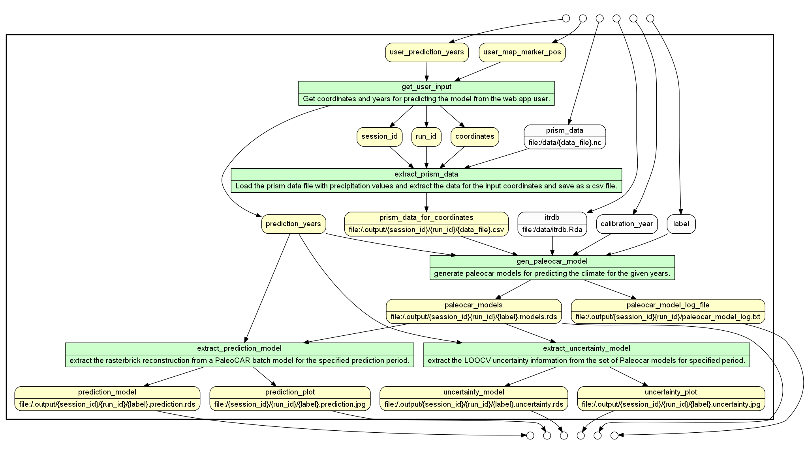

# wt-prov-summer-2017

Software developed as part of the Whole Tale internship on provenance

# Pre-requisite for executing PaleoCar using the web application. 
1. Install [R](https://cran.r-project.org/bin/windows/base/) version 3.3 or above.  
2. Install PaleoCar using the [github repo](https://github.com/bocinsky/paleocar) 
Follow the steps from the readme and execute it once on a local machine. 

# Installing Meteor and Executing webapp for Paleocar

1. Install [meteor](https://www.meteor.com/install) on local machine 
2. Clone the Github repo.
3. Goto the folder wt-prov-summer-2017 using a terminal or command prompt.  
4. Install meteor packages as below
   meteor npm install
5. In the client/main.js file change the value of the variable "curr_dir" to the clone github folder. 
6. Start meteor server as below from terminal 
   meteor run
7. Open the web application from browser as http://localhost:3000

<pre>
wt-prov-summer-2017
   │
   ├── public
   │     ├── images    // contains paleocar result images 
   │     ├── prospective_prov_img // contains provenance graphs images 
   └── server
         └── main.js   // meteor server side file
   └── Rscript       // Contains wrapper Rscripts for executing the paleocar. 
   ├── client  
   │     ├── main.css     // Client side style sheet
   │     ├── main.html    // Client side html file
   │     └── main.js      // Client javascript file 
   ├── data 
   │     ├── DataSource.js //file containing the collection 
   │     └── itrdb.rda         
   ├── lib
   │     └── routes.js
   ├── .prov_scripts
         └── routes.js
         ├── facts
         ├── graphs
         ├── gv_files
         ├── models
         ├── prov_pdf
         ├── results
         ├── retro_prov_facts_queries
         ├── svg_files
         ├── views
         └── yw_scripts
</pre> 
